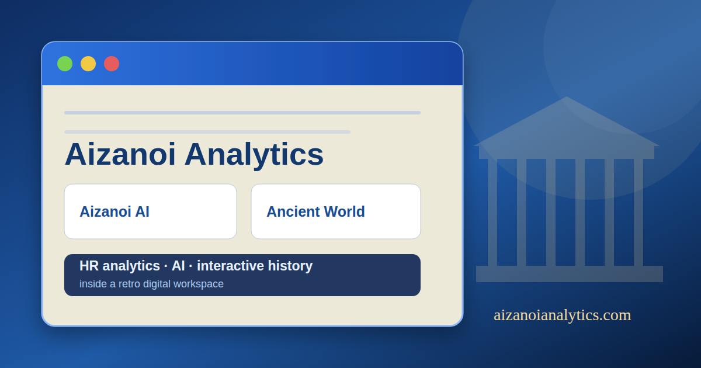

<p align="center">
  
</p>

<h1 align="center">Aizanoi</h1>

<p align="center"><strong>Media, data, software, research and interactive worlds.</strong></p>

<p align="center">
  <a href="https://aizanoianalytics.com"><strong>Live site</strong></a> ·
  <a href="https://aizanoianalytics.com/news/"><strong>News</strong></a> ·
  <a href="https://aizanoianalytics.com/tv/"><strong>TV</strong></a> ·
  <a href="https://aizanoianalytics.com/analytics/"><strong>Analytics</strong></a> ·
  <a href="https://aizanoianalytics.com/worlds/"><strong>Historical Worlds</strong></a>
</p>

---

## What is Aizanoi?

Aizanoi is an independent digital studio presented through **AizanoiOS**, an adaptive browser-native operating-system-style shell.

The umbrella brand contains multiple product families:

- **Aizanoi News** — original, source-linked briefings across AI, Technology, Economy / Markets and Football;
- **Aizanoi TV** — the companion layer for the English-language Aizanoi YouTube channel;
- **Aizanoi Journal** — essays, analysis and commentary;
- **Aizanoi Analytics** — dashboards, data products and analytical utilities;
- **Aizanoi Forge** — source, builds and open projects, with GitHub as the source of truth;
- **Historical Worlds** — evidence-aware walkable Aizanoi, Rome and Athens;
- **Aizanoi Labs** — experiments and prototypes;
- **Aizanoi Arcade** — playable browser games.

The working promise is simple: **Aizanoi is the home of everything we publish, build, research and experiment with.**

See [`PRODUCT.md`](PRODUCT.md).

## AizanoiOS

AizanoiOS uses one public catalog with device-specific interaction models:

- **Desktop:** bright wallpaper-first home, five sparse core shortcuts, freeform windows and centered dock.
- **Tablet:** touch-first two-pane home, larger app grid, feature cards and focused large windows.
- **Mobile:** phone-like home screen, glanceable widgets, public app grid, compact bottom dock and fullscreen app surfaces.

The retired Archive/Notes/Data Lab/Source Reader/Artifact Viewer/Projects/Terminal/Monitor tool bundle is no longer part of the visitor-facing product.

## Aizanoi News

News is static-first and source-led.

```text
web / primary sources
        ↓
      Hermes
        ↓
content/news/items/*.json
        ↓
node scripts/news/build-news.mjs
        ↓
frontend/news/index.json
        ↓
     AizanoiOS
```

Every publishable item requires original Aizanoi summary text and at least one source URL. Full third-party article bodies are not republished.

Read [`CONTENT_POLICY.md`](CONTENT_POLICY.md) and [`docs/HERMES_OPERATIONS.md`](docs/HERMES_OPERATIONS.md).

## Historical Worlds

Historical Worlds remain a flagship experience and preserve the evidence-aware research model developed for the original project.

| World | Period / focus |
|---|---|
| **Aizanoi** | Roman Phrygia · c. AD 2nd–3rd century |
| **Rome** | Late Antiquity · AD 410–476 |
| **Athens** | Classical period · c. 432–430 BCE |

Documented/source-supported, archaeological, inferred, atmospheric and disputed information remain explicitly separated.

## Static-first architecture

The visitor-facing site intentionally minimizes attack surface:

- Nginx serves static HTML/CSS/JavaScript/JSON/assets;
- no visitor-facing general application backend;
- no public remote shell;
- no public Hermes runtime;
- historical `/api/chat` remains failed closed;
- secrets/TLS keys/server credentials do not belong in this repository.

Private automation may prepare content and deployments outside the visitor runtime.

See [`ARCHITECTURE.md`](ARCHITECTURE.md) and [`SECURITY.md`](SECURITY.md).

## Repository map

```text
.
├── frontend/                  # production static application
│   ├── content/news/          # generated public News feed
│   ├── js/v3/                 # AizanoiOS + brand platform + apps
│   ├── styles/                # desktop + adaptive device shell
│   ├── historic-world/        # Aizanoi
│   ├── ancient-cities/        # Rome + Athens
│   └── games/                 # Arcade games
├── content/news/              # Git-tracked News source records/templates
├── scripts/news/              # News validation/build pipeline
├── research/                  # Historical research/source material
├── tests/                     # regression/browser/security/visual QA
├── docs/                      # maintained documentation/runbooks
├── infra/                     # sanitized deployment references
├── PRODUCT.md                 # umbrella-brand product constitution
├── CONTENT_POLICY.md          # sourcing/publishing rules
├── AGENTS.md                  # canonical agent instructions
├── DESIGN.md                  # visual/interaction contract
├── ARCHITECTURE.md            # runtime boundaries
└── ROADMAP.md                 # product direction
```

## Development

```bash
git clone https://github.com/aizanoianalytics/aizanoi-analytics.git
cd aizanoi-analytics
python3 -m http.server 4173 --directory frontend
```

Open `http://127.0.0.1:4173/`.

Useful validation:

```bash
node scripts/news/build-news.mjs
node --test tests/*.test.mjs
```

## Project principles

- **One umbrella brand, many coherent product families.**
- **Original value before aggregation.**
- **Sources before claims.**
- **GitHub is the software source of truth.**
- **Static first.**
- **Device-appropriate UX, one public catalog.**
- **Historical evidence before spectacle.**
- **Regression and rendered review before release.**

## License

Released under the [MIT License](LICENSE).
