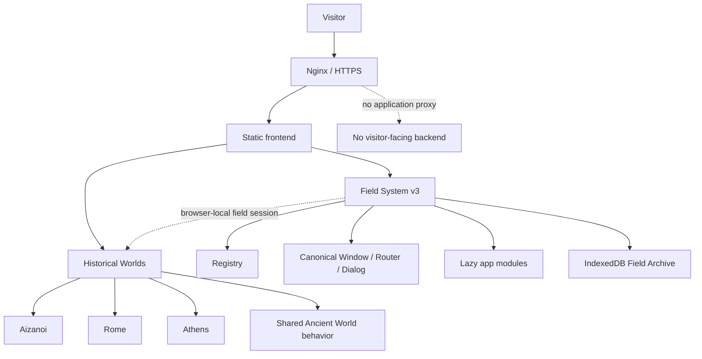

<p align="center">
  
</p>

<h1 align="center">Aizanoi Analytics</h1>

<p align="center"><strong>Walkable history, explicit evidence and a local-first archaeological field workspace.</strong></p>

<p align="center">
  <a href="https://aizanoianalytics.com"><strong>Live site</strong></a> ·
  <a href="https://aizanoianalytics.com/historic-world/"><strong>Aizanoi</strong></a> ·
  <a href="https://aizanoianalytics.com/ancient-cities/rome-410-476/"><strong>Rome</strong></a> ·
  <a href="https://aizanoianalytics.com/ancient-cities/athens-450-430/"><strong>Athens</strong></a>
</p>

<p align="center">
  <a href="https://github.com/aizanoianalytics/aizanoi-analytics/actions/workflows/ci.yml"></a>
  <a href="LICENSE"></a>
  <a href="https://aizanoianalytics.com"></a>
</p>

---

## What is Aizanoi?

Aizanoi Analytics is an independent digital-archaeology project centered on **Aizanoi** in Phrygia and extended through comparative Historical Worlds for **Late Antique Rome** and **Classical Athens**.

The product has two connected layers:

1. **Historical Worlds** — source-led, walkable reconstructions with explicit boundaries between documented evidence, archaeological interpretation, inference and atmosphere.
2. **Aizanoi Field System** — a browser-native workspace for local field records, notes, datasets, sources, visual material and research sessions.

It is intentionally neither a generic browser-OS demo nor a conventional content site. The software exists to make historical space, evidence and research context explorable together.

## Field System v3

Field System v3 replaces the former compatibility-heavy desktop shell with one canonical product architecture.

The design language is **Archaeological Field Instrument OS**:

- **Field Instrument** — calm dark shell, command/search, local-state trust signals;
- **Archive Room** — warm paper reading and writing surfaces;
- **Cinematic Expedition** — full-screen Historical Worlds with restrained evidence-first HUD.

Home is deliberately ordered by value rather than by app count:

1. recommended / continuing field session;
2. Historical Worlds;
3. research workspace;
4. tools and experiments.

Desktop uses freeform windows. Tablet becomes a large focus workspace with touch-sized chrome. Mobile uses fullscreen-equivalent app surfaces with Home/Search/Open navigation. The catalog and product meaning stay consistent across all three.

See **[DESIGN.md](DESIGN.md)** for the maintained visual/interaction contract.

## Historical Worlds

| World | Period / focus | Product role |
|---|---|---|
| **Aizanoi** | Roman Imperial Aizanoi | Reference world: Temple of Zeus, theatre–stadium, Penkalas, civic/residential fabric and guided exploration |
| **Rome** | AD 410–476 | Late-antique transformation, monumental continuity/reuse and explicitly inferred urban fabric |
| **Athens** | c. 432–430 BCE | Acropolis, Agora, Pnyx and Classical civic/topographical reconstruction |

The shared Historical World layer provides traversal/input/evidence behavior without pretending that three cities share identical archaeology. Hero monuments, source metadata and reconstruction choices remain city-local.

The current automated traversal gate walks **51 landmark/jump arrivals** across the three worlds and checks safe support plus a usable first movement step after teleport.

## Research workspace

The canonical registry exposes 11 applications:

| App | Purpose |
|---|---|
| **Historical Worlds** | World index and field-session resume |
| **Field Archive** | Browser-local research records and imports |
| **Field Notes** | Observation, reconstruction-hypothesis and source-review notes |
| **Data Lab** | Local CSV/JSON table inspection and summaries |
| **Source Reader** | Local PDF/Markdown/text reading and citation actions |
| **Artifact Viewer** | Visual-record inspection with provenance metadata |
| **Projects** | Current Field System, Historical Worlds and research work |
| **Field Terminal** | Browser-only domain commands; no remote shell |
| **Workspace Monitor** | Real browser storage/PWA/session/viewport status |
| **Aizanoi TV** | Walkthrough/method/story layer without eager external embeds |
| **Experiments** | Local interaction experiments, clearly separated from historical claims |

Research apps share one IndexedDB archive instead of creating separate stores. A sample Aizanoi record and guide make the first Archive launch useful before the user imports anything.

## World ↔ research loop

Historical Worlds keep a small browser-local **Field Session**: current world, optional landmark and update time. The Explore drawer includes **Field System** so the user can return to research tools, then Home can offer **Continue Field Session**.

Large private payloads such as notes/files are never serialized into the public URL.

## Architecture



Key source boundaries:

```text
frontend/
├── index.html                 # small semantic root bootstrap
├── styles/                    # canonical v3 tokens/base/shell/components/apps
├── js/v3/
│   ├── registry.js            # single app/world catalog
│   ├── store.js               # workspace + field-session state
│   ├── shell.js               # window/router/dialog/commands
│   ├── archive-store.js       # IndexedDB records
│   └── apps/                  # lazy application modules
├── ancient-world/             # shared Historical World engine/presentation
├── ancient-cities/            # Rome, Athens and template
├── historic-world/            # Aizanoi reference world
└── games/                     # local experiments
```

The old global compatibility CSS/OS stack is retired; new work must modify the canonical layer that owns the behavior rather than adding another override stylesheet.

See **[ARCHITECTURE.md](ARCHITECTURE.md)**.

## Evidence policy

Reconstruction quality is not the same thing as photorealism. Aizanoi keeps explicit distinctions between:

- documented/source-supported information;
- archaeological/material evidence;
- reasoned inference;
- atmospheric reconstruction;
- disputed interpretations where applicable.

Generic procedural fabric must never silently become “known history”.

Research starting points:

- [`research/rome_410_476/RESEARCH_BRIEF.md`](research/rome_410_476/RESEARCH_BRIEF.md)
- [`research/rome_410_476/`](research/rome_410_476/)
- [`research/athens_450_430/`](research/athens_450_430/)
- [`frontend/ancient-world/engine/evidence.js`](frontend/ancient-world/engine/evidence.js)
- [`frontend/ancient-cities/_template/`](frontend/ancient-cities/_template/)

## Static-first security

The public site intentionally minimizes server attack surface:

- no visitor-facing application backend;
- no remote/server terminal execution;
- no public AI runtime;
- Archive/Notes/Data records stay in browser storage unless the user explicitly exports/downloads them;
- historical `/api/chat` fails with `410 Gone`;
- other `/api/*` paths fail closed;
- the service worker never intercepts API paths;
- production secrets/TLS keys/server-specific credentials do not live here.

The sanitized Nginx example also documents gzip delivery, PWA manifest MIME, bounded static caching and `/.well-known/security.txt`.

See **[SECURITY.md](SECURITY.md)**.

## Quality gates

The GitHub Actions workflow covers:

- JavaScript syntax checks;
- Node regression/security contracts;
- source-level retired-product checks;
- Field System desktop/tablet/mobile Chromium smoke;
- axe-core serious/critical accessibility gate on canonical surfaces;
- dialog focus/inert/restore and route/window consistency;
- lazy-loading assertions;
- Historical World deep-link/UI/traversal regression;
- 51-landmark walk validation;
- rendered visual-review artifacts;
- Lighthouse budgets;
- whitespace checks.

Core source tests:

```bash
node --test tests/*.test.mjs
```

## Run locally

No application backend is required.

```bash
git clone https://github.com/aizanoianalytics/aizanoi-analytics.git
cd aizanoi-analytics
python3 -m http.server 4173 --directory frontend
```

Open `http://127.0.0.1:4173/`.

## Repository map

```text
.
├── frontend/          # production static application
├── research/          # historical research/source material
├── tests/             # regression, Chromium, security and visual QA
├── docs/              # maintained supporting documentation
├── infra/             # sanitized deployment references
├── DESIGN.md          # canonical product/design language
├── ARCHITECTURE.md    # canonical runtime/component boundaries
├── SECURITY.md        # vulnerability reporting and security boundaries
├── CONTRIBUTING.md    # contribution workflow
├── ROADMAP.md         # product direction
└── CHANGELOG.md       # project milestones
```

## Project principles

- **Evidence before spectacle.**
- **Static first.**
- **Worlds before tool chrome.**
- **One registry and one lifecycle.**
- **One product across devices.**
- **Local research stays local unless export is explicit.**
- **No compatibility layer as a substitute for architecture.**
- **Regression and rendered review before release.**

## Contributing and security

Read **[CONTRIBUTING.md](CONTRIBUTING.md)** before proposing a change. Security issues should follow **[SECURITY.md](SECURITY.md)** rather than publishing exploit detail in a normal issue.

## License

Released under the **[MIT License](LICENSE)**.

---

<p align="center"><strong>Aizanoi is the center of the project; the software exists to make historical space, evidence and research context explorable.</strong></p>
