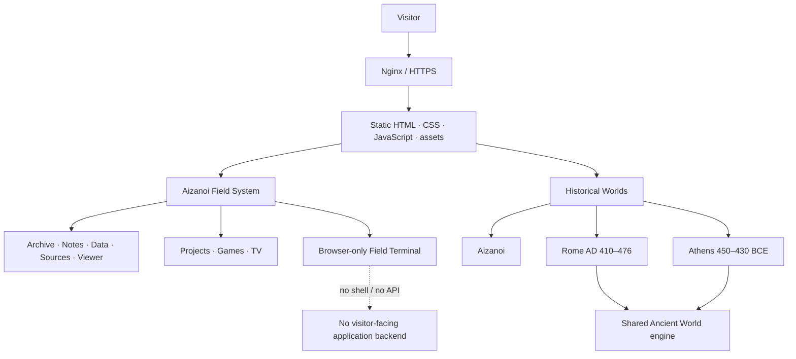

<p align="center">
  
</p>

<h1 align="center">Aizanoi Analytics</h1>

<p align="center">
  <strong>Interactive history, digital archaeology and a browser-native field system.</strong>
</p>

<p align="center">
  Explore research-led historical worlds, local research tools and experimental browser applications through one static, open-source interface.
</p>

<p align="center">
  <a href="https://aizanoianalytics.com"><strong>Live site</strong></a> ·
  <a href="https://aizanoianalytics.com/historic-world/"><strong>Aizanoi Historic World</strong></a> ·
  <a href="https://aizanoianalytics.com/ancient-cities/rome-410-476/"><strong>Rome</strong></a> ·
  <a href="https://aizanoianalytics.com/ancient-cities/athens-450-430/"><strong>Athens</strong></a>
</p>

<p align="center">
  <a href="https://github.com/aizanoianalytics/aizanoi-analytics/actions/workflows/ci.yml"></a>
  <a href="https://github.com/aizanoianalytics/aizanoi-analytics/actions/workflows/security.yml"></a>
  <a href="LICENSE"></a>
  <a href="https://aizanoianalytics.com"></a>
</p>

---

## What is Aizanoi Analytics?

Aizanoi Analytics is an independent, open-source digital-history project built around **Aizanoi**, the ancient city in Phrygia, while extending into comparative historical environments such as **Late Antique Rome** and **Classical Athens**.

The project has two connected layers:

1. **Historical Worlds** — walkable, interactive reconstructions built from source-led city data, explicit reconstruction assumptions and shared traversal/rendering systems.
2. **Aizanoi Field System** — a desktop/tablet/mobile browser workspace containing local tools for archives, notes, datasets, sources, artifacts, projects, games and a safe virtual terminal.

The result is intentionally not a conventional content site and not a game engine demo. It is a **browser-native field notebook for exploring history through data, spatial reconstruction and interactive software**.

## Explore the historical worlds

| World | Period / focus | Highlights | Live |
|---|---|---|---|
| **Aizanoi Historic World** | Roman Aizanoi | Temple, theatre/stadium complex, riverfront, residential fabric, guided landmark movement | [Open](https://aizanoianalytics.com/historic-world/) |
| **Rome** | AD 410–476 | Colosseum, Forum, Pantheon, late-antique urban fabric, shared evidence/movement engine | [Open](https://aizanoianalytics.com/ancient-cities/rome-410-476/) |
| **Athens** | 450–430 BCE | Acropolis, Agora, Pnyx, Classical urban fabric and terrain | [Open](https://aizanoianalytics.com/ancient-cities/athens-450-430/) |

Historical-world code is separated from the research material that informs it. Rome and Athens include dedicated research folders, city-source modules and explicit methodology layers.

## Aizanoi Field System

The public shell is one synchronized interface across desktop, tablet and mobile. Layout changes with the device; product identity and core applications do not.

The current featured workspace contains **11 applications**:

| App | Purpose |
|---|---|
| **Worlds** | Launch Aizanoi, Rome and Athens |
| **Archive** | Local browser-based research collections |
| **Notes** | Field notes and working text |
| **Data** | Local CSV/JSON inspection and analysis |
| **Sources** | Read source records from the local archive |
| **Viewer** | Inspect artifacts and archive items |
| **Projects** | Browse project experiments and builds |
| **Terminal** | Browser-only virtual shell with a fixed in-memory filesystem |
| **Monitor** | Workspace/runtime status without a visitor-facing backend |
| **TV** | Video / walkthrough layer for the project |
| **Games** | Small local browser-native experiments |

On desktop and tablet, applications use a windowed workspace. On mobile, the same applications adapt to fullscreen-equivalent surfaces and touch-first navigation.

## Design direction

Aizanoi Field System deliberately mixes two ideas:

- **nostalgia** — field terminals, archival interfaces, restrained workstation references;
- **modern product design** — responsive layouts, clear hierarchy, touch ergonomics, accessible focus states and a unified cross-device system.

It is not intended to imitate one specific historical operating system. The interface is increasingly its own Aizanoi visual language.

## Architecture



The production website is intentionally **static-only**. Nginx serves the frontend directly; there is no public Node/Express application service behind the site.

For the maintained component map and change rules, see **[ARCHITECTURE.md](ARCHITECTURE.md)**.

## Research and reconstruction policy

Historical reconstruction is treated as an evidence problem, not just a visual problem.

The project distinguishes between:

- documented / source-supported information;
- archaeological or topographical inference;
- procedural / atmospheric reconstruction used to make a city readable and explorable.

Procedural detail must not silently become historical certainty. City implementations keep research notes, manifests and methodology close to the code so that visual decisions can be audited and revised.

Useful starting points:

- [`research/rome_410_476/`](research/rome_410_476/)
- [`research/athens_450_430/`](research/athens_450_430/)
- [`frontend/ancient-world/engine/evidence.js`](frontend/ancient-world/engine/evidence.js)
- [`frontend/ancient-cities/_template/`](frontend/ancient-cities/_template/) — template for adding another city without cloning the entire engine

## Static-first security model

The public application intentionally minimizes server-side attack surface:

- no visitor-facing Node/Express backend;
- no server-side terminal execution;
- Field Terminal is a fixed browser simulation and has no host filesystem access;
- external AI provider integration is removed and legacy AI surfaces fail closed;
- local Archive / Notes / Data Lab state stays in browser storage unless the user exports it;
- historical `/api/chat` returns `410 Gone` in production;
- other historical/unknown `/api/*` paths fail closed;
- production secrets, TLS keys and server-specific configuration are not stored in this repository.

See **[SECURITY.md](SECURITY.md)** for the reporting policy and security boundaries.

## Quality gates

Changes are tested as a product, not only as source files.

GitHub Actions currently cover:

- JavaScript syntax validation;
- Node regression tests;
- static-runtime security contracts;
- desktop / tablet / mobile Chromium smoke tests;
- browser-only Terminal behavior and no-API assertions;
- Rome / Athens movement, landmark and deep-link behavior;
- visual review capture;
- Lighthouse performance / quality budgets;
- whitespace and deployment-contract checks.

Run the core regression suite locally with:

```bash
node --test tests/*.test.mjs
```

## Run locally

No application backend is required.

```bash
git clone https://github.com/aizanoianalytics/aizanoi-analytics.git
cd aizanoi-analytics
python3 -m http.server 4173 --directory frontend
```

Then open:

```text
http://127.0.0.1:4173/
```

For interactive Chromium smoke tests, the CI workflow documents the pinned Playwright setup used by the project.

## Repository map

```text
.
├── frontend/                    # production static web application
│   ├── ancient-world/           # shared historical-world engine
│   ├── ancient-cities/          # Rome, Athens and city template
│   ├── historic-world/          # Aizanoi reference world
│   ├── js/                      # Field System runtime and applications
│   ├── css/                     # unified desktop/tablet/mobile presentation
│   ├── games/                   # local browser games
│   └── assets/                  # branding, icons and wallpapers
├── research/                    # historical research and verified source material
├── tests/                       # regression, Chromium, security and visual QA
├── docs/                        # accessibility, OS and project documentation
├── infra/                       # sanitized static Nginx deployment reference
├── ARCHITECTURE.md              # maintained component map
├── SECURITY.md                  # vulnerability reporting and security boundaries
├── CONTRIBUTING.md              # contribution workflow and project principles
├── ROADMAP.md                   # product direction
└── CHANGELOG.md                 # dated project milestones
```

## Project principles

- **Static first.** A browser feature should not gain a public backend without a demonstrated need and separate security review.
- **Evidence before spectacle.** Reconstruction quality includes uncertainty and source transparency.
- **One product across devices.** Desktop, tablet and mobile should remain equivalent, not diverge into separate products.
- **Shared systems over city forks.** Reusable movement, lifecycle, evidence and rendering behavior belongs in the shared Ancient World engine.
- **Local before social.** Accounts, comments, multiplayer and shared leaderboards are not current product goals.
- **Regression before release.** Interactive changes need automated coverage and visual review.

## Roadmap

The next major product focus is deeper historical-world quality rather than adding more OS chrome: landmark fidelity, guided exploration, evidence presentation, mapping, source transparency and mobile performance.

See **[ROADMAP.md](ROADMAP.md)** for the current direction.

## Contributing

Contributions are welcome when they fit the project's product and historical-methodology boundaries. Please read **[CONTRIBUTING.md](CONTRIBUTING.md)** before opening a pull request.

For security issues, do **not** publish exploit details in a normal issue. Follow **[SECURITY.md](SECURITY.md)**.

## License

Released under the **[MIT License](LICENSE)**.

---

<p align="center">
  <strong>Aizanoi is the center of the project; the software exists to make historical space, evidence and experimentation explorable.</strong>
</p>
